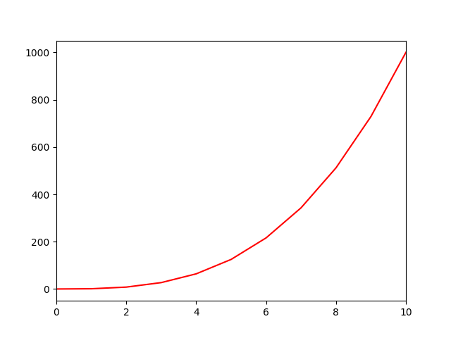

# 0x01. Plotting

```bash
██████╗ ██╗      ██████╗ ████████╗████████╗██╗███╗   ██╗ ██████╗
██╔══██╗██║     ██╔═══██╗╚══██╔══╝╚══██╔══╝██║████╗  ██║██╔════╝
██████╔╝██║     ██║   ██║   ██║      ██║   ██║██╔██╗ ██║██║  ███╗
██╔═══╝ ██║     ██║   ██║   ██║      ██║   ██║██║╚██╗██║██║   ██║
██║     ███████╗╚██████╔╝   ██║      ██║   ██║██║ ╚████║╚██████╔╝
╚═╝     ╚══════╝ ╚═════╝    ╚═╝      ╚═╝   ╚═╝╚═╝  ╚═══╝ ╚═════╝
```

## Environment

[](https://ubuntu.com/)<!-- ubuntu -->
[](https://www.kali.org/)<!-- kali linux -->
[](https://www.gnu.org/software/bash/)<!-- bash -->
[](https://www.vim.org/)<!-- vim -->
[](https://code.visualstudio.com/)<!-- vs code -->
[](https://www.jetbrains.com/pycharm/)<!-- pycharm -->
[](https://git-scm.com/)<!-- git -->
[](https://github.com)<!-- github -->
[](https://app.vagrantup.com/)<!-- vagrant -->

[](https://www.python.org)<!-- python-->

- `numpy` 1.19.2
- `matplotlib` 3.3.4
- `pycodestyle` 2.6

### Configure environment

> Installing Matplotlib 3.3.4

- `pip install --user matplotlib==3.3.4`
- `pip install --user Pillow`
- `sudo apt-get install python3-tk`

> Configure X11 Forwarding

Update your Vagrantfile to include the following:

```Vagrantfile
Vagrant.configure(2) do |config|
  ...
  config.ssh.forward_x11 = true
end
```

## plots




## Author
<!-- twitter -->
[](https://twitter.com/ralex_uy) <!-- linkedin --> [](https://www.linkedin.com/in/ronald-rivero/) <!-- github --> [](https://github.com/ralexrivero/) <!-- vagrant --> [](https://app.vagrantup.com/ralexrivero) <!-- docker --> [](https://hub.docker.com/u/ralexrivero)