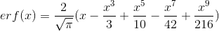

# 0x03. Probability

```bash
██████╗ ██████╗  ██████╗ ██████╗  █████╗ ██████╗ ██╗██╗     ██╗████████╗██╗   ██╗
██╔══██╗██╔══██╗██╔═══██╗██╔══██╗██╔══██╗██╔══██╗██║██║     ██║╚══██╔══╝╚██╗ ██╔╝
██████╔╝██████╔╝██║   ██║██████╔╝███████║██████╔╝██║██║     ██║   ██║    ╚████╔╝
██╔═══╝ ██╔══██╗██║   ██║██╔══██╗██╔══██║██╔══██╗██║██║     ██║   ██║     ╚██╔╝
██║     ██║  ██║╚██████╔╝██████╔╝██║  ██║██████╔╝██║███████╗██║   ██║      ██║
╚═╝     ╚═╝  ╚═╝ ╚═════╝ ╚═════╝ ╚═╝  ╚═╝╚═════╝ ╚═╝╚══════╝╚═╝   ╚═╝      ╚═╝
```

## Environment

[](https://ubuntu.com/)<!-- ubuntu -->
[](https://www.gnu.org/software/bash/)<!-- bash -->
[](https://www.vim.org/)<!-- vim -->
[](https://code.visualstudio.com/)<!-- vs code -->

- `pycodestyle`

> Mathematical approximations

- π = 3.1415926536
- e = 2.7182818285
- 

## Poisson Distribution

- The Poisson distribution is a discrete probability distribution that expresses the probability of a given number of events occurring in a fixed interval of time and/or space if these events occur with a known constant rate and independently of the time since the last event. The Poisson distribution can also be used for the number of events in other specified intervals such as distance, area or volume. The occurrence of events are independent from each other.

## Author

<!-- twitter -->
[](https://twitter.com/ralex_uy) <!-- linkedin --> [](https://www.linkedin.com/in/ronald-rivero/) <!-- github --> [](https://github.com/ralexrivero/) <!-- vagrant --> [](https://app.vagrantup.com/ralexrivero) <!-- docker --> [](https://hub.docker.com/u/ralexrivero)
